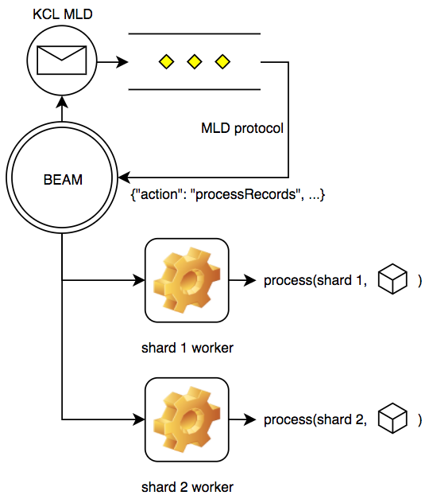
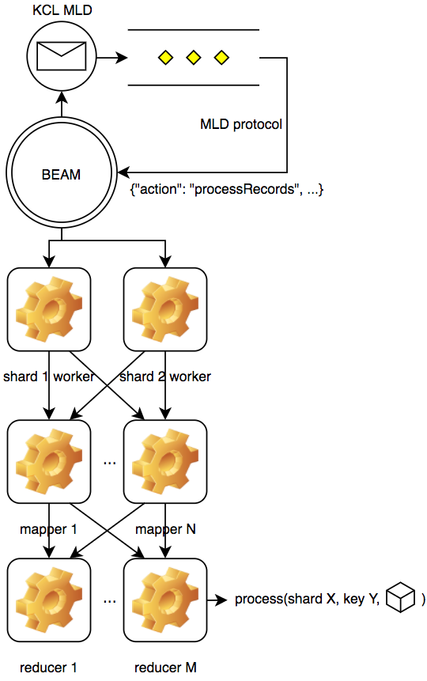

# exmld

This application allows Kinesis and DynamoDB streams to be processed using Elixir or
Erlang (by way of the KCL MultiLangDaemon).  It's particularly useful when aggregate
records are being used and items can be processed in approximate order (as opposed to
strict order within each shard).

Using [erlmld](https://github.com/AdRoll/erlmld), a normal Erlang Kinesis processing
application looks like this:

Using this Elixir library (which uses erlmld), a processing application looks like this:

This is done using the [Flow](https://hexdocs.pm/flow/Flow.html) framework to set up a
MapReduce-style processing pipeline within a single BEAM node.
